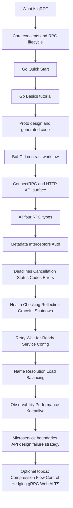

# gRPC + Microservices in Go Roadmap

A practical roadmap for learning **gRPC in Go** and then extending it into **microservices
thinking** without relying on weak books or random tutorial fragments.

This roadmap is built around the idea that you should first learn **gRPC as a communication
technology**, then **gRPC in Go**, then **production concerns**, and only after that treat it as
part of a broader microservice architecture.

---

## Learning map

---

## Main principle

Do **not** start with “microservices” as a buzzword.

Start with this order:

1. **gRPC fundamentals**
2. **gRPC in Go**
3. **Production mechanics**
4. **Reliability and observability**
5. **Microservice architecture around gRPC**

That order matters. Otherwise you end up with three services, five containers, and no idea why
requests fail, which is a pretty common human hobby.

---

## Current progress

- **Phase 1 — Core gRPC foundation:** complete. Notes are in
  [`grpc-playground/cheatsheet.md`](../../grpc-playground/cheatsheet.md).
- **Phase 2 — gRPC in Go:** complete. `grpc-playground` contains a unary gRPC server and client,
  reproducible protobuf generation, and an in-memory integration test.
- **Current focus:** Phase 3 — Protocol Buffers and contract design.
- **Buf track:** starts in Phase 3 with local CLI, linting, compatibility checks, and generation;
  CI, BSR, and governance come later.
- **Additional tracks:** ConnectRPC, grpc-gateway, OpenAPI, OpenTelemetry, and grpcurl are
  integrated into the later phases without replacing the main `grpc-go` path.

---

## Phase 1. Core gRPC foundation

### Goal
Understand what gRPC is, how RPC calls work, and what makes gRPC different from ordinary HTTP+JSON
APIs.

### Study
- [Introduction to gRPC](https://grpc.io/docs/what-is-grpc/introduction/)
- [Core concepts, architecture and lifecycle](https://grpc.io/docs/what-is-grpc/core-concepts/)
- [RPC life cycle](https://grpc.io/docs/what-is-grpc/core-concepts/#rpc-life-cycle)

### What to learn
- What a **service**, **method**, and **message** are
- The difference between **unary** and **streaming** RPC
- How a client and server communicate over HTTP/2
- Why Protocol Buffers matter
- What happens during one RPC call from request to response

### Deliverable
Write a short personal note answering:
- What is gRPC?
- When would I prefer it over REST?
- What are the 4 RPC types?

---

## Phase 2. gRPC in Go

### Goal
Be able to create and run a basic gRPC server and client in Go.

### Study
- [Quick start | Go](https://grpc.io/docs/languages/go/quickstart/) - [Basics tutorial |
Go](https://grpc.io/docs/languages/go/basics/) - [Generated-code reference |
Go](https://grpc.io/docs/languages/go/generated-code/)

### What to learn
- How to define a `.proto` file
- How to generate Go code from `.proto`
- What server and client stubs look like
- How to register a service implementation
- How to call RPC from a Go client

### Deliverable
Create one small project with:
- 1 gRPC server
- 1 Go client
- 1 unary method
- clean project structure

---

## Phase 3. Protocol Buffers and contract design

### Goal
Treat `.proto` as an API contract, not just a syntax file you feed to `protoc`.

### Study
- [Protocol Buffers](https://protobuf.dev/)
- [Generated-code reference | Go](https://grpc.io/docs/languages/go/generated-code/)
- [Buf CLI](https://buf.build/docs/cli/)
- [Buf lint rules](https://buf.build/docs/lint/rules/)
- [Detecting breaking changes](https://buf.build/docs/breaking/)
- [Generating code with Buf](https://buf.build/docs/generate/)
- [Connect Go](https://pkg.go.dev/connectrpc.com/connect)
- [connectrpc/connect-go](https://github.com/connectrpc/connect-go)
- [grpc-gateway](https://grpc-ecosystem.github.io/grpc-gateway/)
- [grpc-gateway OpenAPI 3.1](https://grpc-ecosystem.github.io/grpc-gateway/docs/mapping/openapi_v3/)

### What to learn
- `package` and `go_package`
- messages and enums
- field numbers and compatibility
- optional vs repeated fields
- naming conventions
- how generated interfaces map to Go code
- Buf workspaces and modules
- formatting and linting with Buf
- breaking-change detection
- reproducible generation and the relationship between `buf generate`, `protoc`, and the Makefile
- protobuf annotations for HTTP routes and preparing a contract for grpc-gateway/OpenAPI

### Practice
Design 2 versions of the same API:
- `v1` with a basic request/response
- `v2` with backward-compatible additions

### Deliverable
Document for yourself:
- what changes are safe
- what changes break compatibility
- what regeneration changes in Go

### Buf progression

Start with the local Buf CLI and apply it to `helloworld` to understand the existing lint warnings.
Then use Buf with the Phase 3 `v1` and `v2` contracts. Keep the current `protoc`/Makefile workflow
as a comparison baseline before moving to Buf generation and dependency management.

The broader Buf path continues later with modules, dependency versions, remote plugins, CI checks,
the Buf Schema Registry, and governance.

### ConnectRPC and HTTP API progression

After the basic contract is stable, compare ConnectRPC with the current `grpc-go` runtime. Study its
gRPC and gRPC-Web compatibility, HTTP/1.1 support, streaming, browser access, and deployment
trade-offs without replacing the primary implementation.

Then add grpc-gateway as an HTTP/JSON adapter over the same gRPC service. Generate an OpenAPI
description from the protobuf and gateway annotations, validate it, and record which gRPC features
do not map directly to OpenAPI.

---

## Phase 4. All 4 RPC types

### Goal
Stop thinking that gRPC is just “REST but compiled”.

### Study
Use the Go basics tutorial and extend it with your own examples.

### Learn by implementing
- **Unary RPC**
- **Server streaming RPC**
- **Client streaming RPC**
- **Bidirectional streaming RPC**

### Deliverable
One service exposing all 4 method types.

Suggested domain ideas:
- notifications
- logs/events
- route tracking
- chat-like demo
- metrics collector

---

## Phase 5. Metadata, interceptors, and auth

### Goal
Understand cross-cutting behavior in gRPC.

### Study
- [Metadata](https://grpc.io/docs/guides/metadata/)
- [Interceptors](https://grpc.io/docs/guides/interceptors/)
- [Authentication](https://grpc.io/docs/guides/auth/)

### What to learn
- request/response metadata
- unary vs stream interceptors
- auth token propagation
- tracing or request-id propagation
- simple middleware patterns in gRPC
- context propagation shared by gRPC, ConnectRPC, grpc-gateway, and OpenTelemetry

### Practice
Add to your server:
- request ID in metadata
- logging interceptor
- auth check interceptor
- timing/latency interceptor

### Deliverable
A reusable interceptor package for your training project.

---

## Phase 6. Deadlines, cancellation, status codes, errors

### Goal
Handle failure correctly instead of returning random `fmt.Errorf` sadness.

### Study
- [Deadlines](https://grpc.io/docs/guides/deadlines/)
- [Cancellation](https://grpc.io/docs/guides/cancellation/)
- [Status codes](https://grpc.io/docs/guides/status-codes/)
- [Error handling](https://grpc.io/docs/guides/error/)

### What to learn
- how clients set deadlines
- how servers respect context cancellation
- canonical status codes
- mapping business errors to gRPC errors
- why timeouts are part of API behavior

### Practice
Implement cases for:
- invalid input
- not found
- permission denied
- unavailable dependency
- deadline exceeded

### Deliverable
A small error mapping table for your project.

---

## Phase 7. Operational basics

### Goal
Make the service operable in a real environment.

### Study
- [Health checking](https://grpc.io/docs/guides/health-checking/)
- [Server reflection](https://grpc.io/docs/guides/reflection/)
- [Graceful shutdown](https://grpc.io/docs/guides/server-graceful-stop/)

### What to learn
- how health probes work
- why reflection is useful in development and debugging
- how to stop a server without killing in-flight requests

### Practice
Add:
- health service
- reflection in dev mode
- signal handling with graceful shutdown
- CI checks for protobuf linting, breaking changes, and generated-code consistency
- use `grpcurl` with reflection for manual service, method, metadata, and deadline checks

### Deliverable
A service that can be run, probed, and stopped correctly.

The project should also have a documented place for Buf checks in its CI workflow, even if the first
implementation remains local.

Use `grpcurl` for manual smoke and debugging checks, not as a replacement for typed Go tests.

---

## Phase 8. Reliability from the client side

### Goal
Learn how gRPC clients behave under failures.

### Study
- [Retry](https://grpc.io/docs/guides/retry/)
- [Wait-for-Ready](https://grpc.io/docs/guides/wait-for-ready/)
- [Service Config](https://grpc.io/docs/guides/service-config/)
- [Request Hedging](https://grpc.io/docs/guides/request-hedging/)

### What to learn
- transparent retry vs configured retry
- per-method policies
- retry limits
- how wait-for-ready changes failure behavior
- why retries can amplify failures if abused

### Practice
Create a flaky downstream service and test:
- immediate failure
- retry policy
- deadline interactions
- wait-for-ready behavior

### Deliverable
A short note describing when retries are safe and when they are dangerous.

---

## Phase 9. Name resolution and load balancing

### Goal
Understand how clients find servers and distribute calls.

### Study
- [Custom name resolution](https://grpc.io/docs/guides/custom-name-resolution/)
- [Load balancing](https://grpc.io/docs/guides/custom-load-balancing/)
- [Service Config](https://grpc.io/docs/guides/service-config/)

### What to learn
- resolver vs balancer roles
- static vs dynamic target discovery
- round robin basics
- how service config affects client behavior

### Practice
Run 2 instances of the same service and test a balancing strategy.

### Deliverable
A mini-demo with one client and multiple backend instances.

---

## Phase 10. Observability and performance

### Goal
Measure and tune behavior instead of guessing.

### Study
- [OpenTelemetry Metrics](https://grpc.io/docs/guides/opentelemetry-metrics/)
- [Performance Best Practices](https://grpc.io/docs/guides/performance/)
- [Keepalive](https://grpc.io/docs/guides/keepalive/)
- [Flow Control](https://grpc.io/docs/guides/flow-control/)
- [Compression](https://grpc.io/docs/guides/compression/)
- [OpenTelemetry Go](https://opentelemetry.io/docs/languages/go/)
- [OpenTelemetry exporters](https://opentelemetry.io/docs/languages/go/exporters/)
- [grpcurl](https://github.com/fullstorydev/grpcurl)

### What to learn
- request counts, latency, errors
- server/client side metrics
- connection reuse
- keepalive tradeoffs
- streaming backpressure and flow control
- when compression helps or hurts
- traces for incoming and outgoing RPCs
- metrics for request counts, latency, errors, and message sizes
- context propagation across service boundaries
- OTLP export and a local telemetry backend

### Practice
Add metrics and compare:
- unary vs streaming throughput
- small vs large payloads
- with and without compression
- with and without keepalive tuning
- gRPC, ConnectRPC, and HTTP gateway observability

### Deliverable
A simple benchmark report in Markdown.

---

## Phase 11. Microservices around gRPC

### Goal
Use gRPC inside a meaningful multi-service architecture.

### Important note
The official gRPC docs are strong on **RPC mechanics**, but they are **not a full course in
microservice architecture**. That part you should learn separately.

### Recommended companion maps
- [Go roadmap](https://roadmap.sh/golang)
- [Backend roadmap](https://roadmap.sh/backend)
- [API Design roadmap](https://roadmap.sh/api-design)
- [System Design roadmap](https://roadmap.sh/system-design)

### What to learn here
- service boundaries
- synchronous vs asynchronous communication
- failure propagation
- idempotency
- contracts between services
- observability across service boundaries
- when *not* to split a service

### Practice project
Build a small 3-service system:
- `users`
- `orders`
- `payments`

Add:
- gRPC service-to-service calls
- health checks
- deadlines
- retries
- structured logging
- metrics
- one flaky dependency simulation

### Deliverable
A README explaining:
- architecture
- service responsibilities
- critical failure paths
- retry and timeout rules
- internal gRPC calls and the HTTP/JSON gateway surface
- OpenAPI documentation
- grpcurl smoke checks
- OpenTelemetry across service boundaries

The project should also use Buf for shared contracts between services. Study publishing and
consuming schemas through the Buf Schema Registry, versioning, access, distribution, and
compatibility rules between services and teams.

The gateway remains an adapter over the gRPC services rather than a second business contract.

---

## Phase 12. Optional advanced topics

Study these after the main path, not before.

### Topics
- [gRPC-Web](https://grpc.io/docs/platforms/web/)
- [ALTS](https://grpc.io/docs/guides/alts/)
- [Debugging](https://grpc.io/docs/guides/debugging/)
- [Custom backend metrics](https://grpc.io/docs/guides/custom-backend-metrics/)
- [Reflection](https://grpc.io/docs/guides/reflection/) in tooling-heavy workflows
- [Buf Schema Registry](https://buf.build/docs/bsr/introduction/)
- [Buf modules and dependencies](https://buf.build/docs/cli/modules/)
- [Remote plugins and generation](https://buf.build/docs/generate/)
- [Managed mode](https://buf.build/docs/generate/managed-mode/)
- [Buf governance and policy](https://buf.build/docs/bsr/)

### Notes
- **gRPC-Web** matters if your client is a browser.
- **ALTS** is not a first-priority topic for ordinary backend work.
- **Debugging tools** become more useful once you already have real services.
- **Buf advanced workflows** belong here: remote modules and plugins, managed mode, registry
  workflows, policy-as-code, CI/CD integrations, and scaling protobuf governance across a monorepo.
- **ConnectRPC advanced topics** include protocol and runtime trade-offs, browser access, streaming,
  and deployment patterns.
- **HTTP/API advanced topics** include OpenAPI limitations and gateway deployment patterns.
- **OpenTelemetry advanced topics** include sampling, exporters, and backend integration.
- **grpcurl advanced workflows** include descriptor/protoset usage and non-reflection diagnostics.

---

# Recommended study order: Now / Next / Later

## Now
- [x] Introduction to gRPC
- [x] Core concepts
- [x] Go Quick Start
- [x] Go Basics tutorial
- [x] Generated-code reference
- [x] One unary RPC in Go
- [ ] All 4 RPC types in one demo service
- [ ] Buf local CLI workflow
- [ ] grpcurl reflection and unary RPC workflow

## Next
- [ ] Proto design and compatibility
- [ ] Buf lint, format, breaking, and generate
- [ ] ConnectRPC comparison
- [ ] grpc-gateway and OpenAPI basics
- [ ] Metadata
- [ ] Interceptors
- [ ] Authentication basics
- [ ] Deadlines
- [ ] Cancellation
- [ ] Status codes
- [ ] Error handling
- [ ] Health checking
- [ ] Reflection
- [ ] Graceful shutdown

## Later
- [ ] Retry
- [ ] Wait-for-ready
- [ ] Service Config
- [ ] Name resolution
- [ ] Load balancing
- [ ] OpenTelemetry metrics
- [ ] OpenTelemetry traces and context propagation
- [ ] Performance tuning
- [ ] Keepalive
- [ ] Flow control
- [ ] Compression
- [ ] Multi-service training project
- [ ] Buf CI checks and generated-code policy
- [ ] Buf Schema Registry and contract distribution
- [ ] gRPC-Web / ALTS / advanced extras
- [ ] Buf modules, remote plugins, managed mode, and governance
- [ ] grpcurl protoset and non-reflection workflows
- [ ] ConnectRPC, gateway, and OpenAPI advanced topics

---

# Minimal practical project sequence

## Project 1. `grpc-playground`
One Go server and one Go client.

Must include:
- unary RPC
- server streaming RPC
- client streaming RPC
- bidirectional streaming RPC
- simple `.proto`

## Project 2. `grpc-runtime`
Turn the playground into a more realistic service.

Add:
- metadata
- interceptors
- auth token check
- deadlines
- cancellation handling
- status codes
- graceful shutdown
- health checking
- reflection
- Buf linting, breaking-change checks, and reproducible generation
- ConnectRPC comparison
- grpc-gateway and OpenAPI HTTP surface
- grpcurl smoke checks

## Project 3. `grpc-micro-lab`
Three services with realistic behavior.

Add:
- service-to-service gRPC calls
- retry policies
- flaky dependency simulation
- metrics
- timeout rules
- one load balancing experiment
- architecture README
- shared contracts managed through Buf modules or the Buf Schema Registry
- HTTP/JSON gateway, OpenAPI documentation, and OpenTelemetry between services

---

# How to use this roadmap

Use this roadmap in a strict way:

1. Read the official page
2. Build the smallest working example
3. Break it on purpose
4. Write down what actually happened
5. Move to the next topic only after hands-on practice

That is the whole trick. Not glamorous, not mystical, just effective.

---

# Final advice

Do not search for one magical resource that teaches **gRPC + Go + microservices + production +
architecture + observability** perfectly in one place.

That resource rarely exists.

A better approach is:
- use **official gRPC docs** as the main spine
- use **Go practice projects** as the muscle
- use **backend/system design material** as the architectural layer

That gives you an actual path instead of tutorial confetti.
