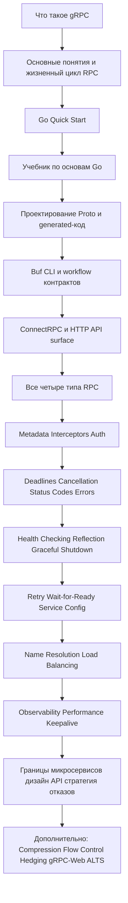

# gRPC + микросервисы на Go: roadmap

Практический roadmap для изучения **gRPC на Go** и последующего перехода к **микросервисному
мышлению** без слабых книг и случайных фрагментов учебников.

Этот roadmap построен на идее, что сначала нужно изучить **gRPC как технологию взаимодействия**,
затем **gRPC на Go**, потом **production-механику**, и только после этого рассматривать gRPC как
часть более широкой микросервисной архитектуры.

---

## Карта обучения

---

## Главный принцип

Не начинайте с «микросервисов» как с модного buzzword.

Начните в таком порядке:

1. **Основы gRPC**
2. **gRPC на Go**
3. **Production-механика**
4. **Надёжность и observability**
5. **Микросервисная архитектура вокруг gRPC**

Этот порядок важен. Иначе можно получить три сервиса, пять контейнеров и не понять, почему запросы
завершаются ошибкой. Это довольно распространённое человеческое увлечение.

---

## Текущий прогресс

- **Фаза 1 — Основы gRPC:** завершена. Конспект находится в
  [`grpc-playground/cheatsheet.md`](../../grpc-playground/cheatsheet.md).
- **Фаза 2 — gRPC на Go:** завершена. В `grpc-playground` есть unary gRPC-сервер и клиент,
  воспроизводимая генерация protobuf-кода и integration test в памяти.
- **Текущий фокус:** Фаза 3B — Buf contract workflow.
- **Фаза 3A:** завершена. Версии контракта, generated-код, focused tests совместимости и запись
  review готовы.
- **Трек Buf:** начинается в Phase 3 с локального CLI, linting, проверок совместимости и генерации;
  CI, BSR и governance идут позже.
- **Дополнительные треки:** ConnectRPC, grpc-gateway, OpenAPI, OpenTelemetry и grpcurl встроены в
  последующие фазы, но не заменяют основной путь `grpc-go`.

---

## Фаза 1. Основы gRPC

### Цель

Понять, что такое gRPC, как выполняются RPC-вызовы и чем gRPC отличается от обычных HTTP+JSON API.

### Что изучить

- [Введение в gRPC](https://grpc.io/docs/what-is-grpc/introduction/)
- [Основные понятия, архитектура и жизненный цикл](https://grpc.io/docs/what-is-grpc/core-concepts/)
- [Жизненный цикл RPC](https://grpc.io/docs/what-is-grpc/core-concepts/#rpc-life-cycle)

### Что нужно понять

- что такое **service**, **method** и **message**;
- разницу между **unary** и **streaming** RPC;
- как клиент и сервер взаимодействуют через HTTP/2;
- зачем нужны Protocol Buffers;
- что происходит во время одного RPC-вызова от запроса до ответа.

### Результат

Напишите короткую личную заметку с ответами на вопросы:

- Что такое gRPC?
- Когда я предпочту его REST?
- Какие существуют 4 типа RPC?

---

## Фаза 2. gRPC на Go

### Цель

Научиться создавать и запускать базовые gRPC-сервер и клиент на Go.

### Что изучить

- [Quick start | Go](https://grpc.io/docs/languages/go/quickstart/) - [Учебник по основам |
Go](https://grpc.io/docs/languages/go/basics/) - [Справочник generated-кода |
Go](https://grpc.io/docs/languages/go/generated-code/)

### Что нужно понять

- как определить файл `.proto`;
- как сгенерировать Go-код из `.proto`;
- как выглядят stubs сервера и клиента;
- как зарегистрировать реализацию сервиса;
- как вызвать RPC из Go-клиента.

### Результат

Создайте небольшой проект, содержащий:

- 1 gRPC-сервер;
- 1 Go-клиент;
- 1 unary-метод;
- аккуратную структуру проекта.

---

## Фаза 3A. Проектирование protobuf-контракта

### Цель

Научиться воспринимать `.proto` как API-контракт, а не просто как файл с синтаксисом, который
передаётся в `protoc`.

### Что изучить

- [Protocol Buffers](https://protobuf.dev/)
- [Справочник generated-кода | Go](https://grpc.io/docs/languages/go/generated-code/)

### Что нужно понять

- `package` и `go_package`;
- messages и enums;
- номера полей и совместимость;
- различие между `optional` и `repeated`;
- соглашения об именовании;
- как generated-интерфейсы отображаются на Go-код.
- reserved-номера и имена полей;
- безопасные и ломающие изменения схемы;
- связь `.proto` → `protoc` → generated Go API.

### Практика

Спроектируйте две версии одного API:

- `v1` с базовым request/response;
- `v2` с обратно совместимыми дополнениями.

### Результат

Зафиксируйте для себя в документации:

- какие изменения безопасны;
- какие изменения ломают совместимость;
- как регенерация меняет Go-код.

### Definition of Done

- [x] существуют контракт `v1` и обратно совместимый `v2`;
- [x] правила совместимости, включая `reserved`, документированы;
- [x] изменения generated Go API объяснены;
- [x] focused tests покрывают старый и новый контракт;
- [x] Buf, ConnectRPC, gateway, OpenAPI, OpenTelemetry, grpcurl, CI и Schema Registry не входят в
  эту подфазу.

### Запись review Phase 3A

- Контракты: `catalog/v1/catalog.proto` и `catalog/v2/catalog.proto`.
- Generated-код: `catalog.pb.go` и `catalog_grpc.pb.go` для обеих версий.
- Генерация: отдельные цели `protos-catalog-v1` и `protos-catalog-v2` входят в aggregate-цель
  `protos` Makefile.
- Тесты: round-trip и проверки совместимости `v1` → `v2` и `v2` → `v1`.
- Граница: Buf и инструменты Phase 3C не добавлялись.

---

## Фаза 3B. Buf contract workflow

### Цель

Применить Buf к уже понятному и документированному protobuf-контракту.

### Что изучить

- [Buf CLI](https://buf.build/docs/cli/)
- [Правила Buf lint](https://buf.build/docs/lint/rules/)
- [Проверка breaking changes](https://buf.build/docs/breaking/)
- [Генерация кода с Buf](https://buf.build/docs/generate/)

### Изучение и практика

- установить и использовать локальный Buf CLI;
- настроить `buf.yaml`, workspace и module;
- запустить `buf format` и `buf lint`;
- разобрать warnings текущего `helloworld` без автоматического изменения контракта;
- запустить `buf breaking` для `v1` и `v2`;
- сравнить безопасные и намеренно ломающие изменения;
- запустить `buf generate` и сравнить его с `protoc` и текущим Makefile;
- изучить воспроизводимую генерацию, зависимости и версии.

### Definition of Done

- существует локальная Buf-конфигурация;
- linting и breaking-change проверки запускаются для учебного контракта;
- generated output воспроизводим;
- workflow Buf и `protoc` сравнены в документации;
- принятые, исправленные и отложенные lint warnings зафиксированы;
- BSR, governance, CI/CD, remote plugins, ConnectRPC, gateway, OpenAPI, OpenTelemetry и grpcurl не
  входят в эту подфазу.

---

## Фаза 3C. Инструменты вокруг protobuf и gRPC

### Цель

Понять, как один стабильный protobuf/gRPC-контракт поддерживает разные способы доступа, диагностики
и observability.

### Что изучить

- [Connect Go](https://pkg.go.dev/connectrpc.com/connect)
- [connectrpc/connect-go](https://github.com/connectrpc/connect-go)
- [grpc-gateway](https://grpc-ecosystem.github.io/grpc-gateway/)
- [grpc-gateway OpenAPI 3.1](https://grpc-ecosystem.github.io/grpc-gateway/docs/mapping/openapi_v3/)
- [OpenTelemetry Go](https://opentelemetry.io/docs/languages/go/)
- [OpenTelemetry exporters](https://opentelemetry.io/docs/languages/go/exporters/)
- [grpcurl](https://github.com/fullstorydev/grpcurl)

### Сравнение ConnectRPC

- сравнить ConnectRPC с текущим runtime `grpc-go`;
- изучить совместимость с gRPC и gRPC-Web, HTTP/1.1, browser access, streaming и deployment
  trade-offs;
- создать небольшой сравнительный пример, не заменяя основной путь `grpc-go`.

### grpc-gateway и OpenAPI

- добавить HTTP annotations в стабильный protobuf-контракт;
- сгенерировать grpc-gateway и вызвать тот же сервис через HTTP/JSON;
- сравнить ошибки, metadata и deadlines в gRPC и HTTP/JSON;
- сгенерировать и проверить OpenAPI;
- документировать возможности gRPC, которые не отображаются напрямую в OpenAPI.

grpc-gateway остаётся адаптером над gRPC, а OpenAPI описывает HTTP-поверхность, не создавая второго
бизнес-контракта.

### grpcurl

- использовать после появления reflection;
- просматривать services, methods и messages;
- вызывать unary RPC с JSON-запросами, metadata и deadlines;
- работать с `.proto` или protoset descriptors без reflection;
- использовать для smoke/debug-проверок, а не вместо typed Go tests.

### OpenTelemetry

- instrument incoming и outgoing RPC;
- собирать traces и metrics;
- передавать context за границами сервисов и через gRPC metadata;
- экспортировать данные через OTLP и подключить локальный backend;
- сравнить observability для gRPC, ConnectRPC и HTTP gateway.

### Definition of Done

- для каждого инструмента есть небольшой ограниченный сравнительный или диагностический пример;
- основной путь `grpc-go + protobuf + Buf` не изменён;
- gateway и OpenAPI используют тот же gRPC-контракт;
- grpcurl применяется после reflection и отдельно от typed tests;
- OpenTelemetry покрывает RPC и передачу context между сервисами.

---

## Фаза 4. Все 4 типа RPC

### Цель

Перестать воспринимать gRPC как «REST, только с компиляцией».

### Что изучить

Используйте учебник по основам Go и расширьте его собственными примерами.

### Реализовать на практике

- **Unary RPC**;
- **Server-streaming RPC**;
- **Client-streaming RPC**;
- **Bidirectional-streaming RPC**.

### Результат

Один сервис, предоставляющий все 4 типа методов.

Возможные предметные области:

- уведомления;
- логи/события;
- отслеживание маршрутов;
- демонстрация в стиле чата;
- сборщик метрик.

---

## Фаза 5. Metadata, interceptors и auth

### Цель

Понять сквозное поведение в gRPC.

### Что изучить

- [Metadata](https://grpc.io/docs/guides/metadata/)
- [Interceptors](https://grpc.io/docs/guides/interceptors/)
- [Authentication](https://grpc.io/docs/guides/auth/)

### Что нужно понять

- metadata запроса и ответа;
- unary- и stream-interceptors;
- передачу auth-токена;
- передачу tracing-данных или request ID;
- простые шаблоны middleware в gRPC.
- context propagation, общий для gRPC, ConnectRPC, grpc-gateway и OpenTelemetry.

### Практика

Добавьте на сервер:

- request ID в metadata;
- logging interceptor;
- auth-check interceptor;
- interceptor для измерения времени и latency.

### Результат

Переиспользуемый пакет interceptors для учебного проекта.

---

## Фаза 6. Deadlines, cancellation, status codes и errors

### Цель

Корректно обрабатывать ошибки вместо случайного `fmt.Errorf` с привкусом грусти.

### Что изучить

- [Deadlines](https://grpc.io/docs/guides/deadlines/)
- [Cancellation](https://grpc.io/docs/guides/cancellation/)
- [Status codes](https://grpc.io/docs/guides/status-codes/)
- [Error handling](https://grpc.io/docs/guides/error/)

### Что нужно понять

- как клиенты устанавливают deadlines;
- как серверы учитывают отмену через context;
- канонические status codes;
- отображение бизнес-ошибок на gRPC-ошибки;
- почему timeout является частью поведения API.

### Практика

Реализуйте сценарии:

- некорректный ввод;
- объект не найден;
- доступ запрещён;
- зависимость недоступна;
- deadline exceeded.

### Результат

Небольшая таблица отображения ошибок для проекта.

---

## Фаза 7. Основы эксплуатации

### Цель

Сделать сервис пригодным для работы в реальном окружении.

### Что изучить

- [Health checking](https://grpc.io/docs/guides/health-checking/)
- [Server reflection](https://grpc.io/docs/guides/reflection/)
- [Graceful shutdown](https://grpc.io/docs/guides/server-graceful-stop/)

### Что нужно понять

- как работают health probes;
- почему reflection полезен при разработке и отладке;
- как остановить сервер, не прерывая выполняющиеся запросы.

### Практика

Добавьте:

- health service;
- reflection в режиме разработки;
- обработку сигналов с graceful shutdown.
- CI-проверки protobuf linting, breaking changes и согласованности generated-кода.

### Результат

Сервис, который можно запустить, проверить и корректно остановить.

Используйте `grpcurl` для ручных smoke- и debugging-проверок, а не вместо типизированных Go-тестов.

У проекта также должно быть документированное место для Buf-проверок в CI, даже если первая
реализация пока остаётся локальной.

---

## Фаза 8. Надёжность на стороне клиента

### Цель

Понять, как gRPC-клиенты ведут себя при сбоях.

### Что изучить

- [Retry](https://grpc.io/docs/guides/retry/)
- [Wait-for-Ready](https://grpc.io/docs/guides/wait-for-ready/)
- [Service Config](https://grpc.io/docs/guides/service-config/)
- [Request Hedging](https://grpc.io/docs/guides/request-hedging/)

### Что нужно понять

- transparent retry и настроенный retry;
- политики для отдельных методов;
- ограничения retry;
- как wait-for-ready меняет поведение при ошибках;
- почему бездумные retry могут усиливать сбои.

### Практика

Создайте нестабильный downstream-сервис и проверьте:

- немедленную ошибку;
- retry policy;
- взаимодействие retry с deadline;
- поведение wait-for-ready.

### Результат

Короткая заметка о том, когда retry безопасен, а когда опасен.

---

## Фаза 9. Name resolution и load balancing

### Цель

Понять, как клиенты находят серверы и распределяют вызовы.

### Что изучить

- [Custom name resolution](https://grpc.io/docs/guides/custom-name-resolution/)
- [Load balancing](https://grpc.io/docs/guides/custom-load-balancing/)
- [Service Config](https://grpc.io/docs/guides/service-config/)

### Что нужно понять

- роли resolver и balancer;
- статическое и динамическое обнаружение targets;
- основы round robin;
- как service config влияет на поведение клиента.

### Практика

Запустите 2 экземпляра одного сервиса и проверьте стратегию балансировки.

### Результат

Мини-демо с одним клиентом и несколькими backend-инстансами.

---

## Фаза 10. Observability и производительность

### Цель

Измерять и настраивать поведение вместо того, чтобы гадать.

### Что изучить

- [OpenTelemetry Metrics](https://grpc.io/docs/guides/opentelemetry-metrics/)
- [Performance Best Practices](https://grpc.io/docs/guides/performance/)
- [Keepalive](https://grpc.io/docs/guides/keepalive/)
- [Flow Control](https://grpc.io/docs/guides/flow-control/)
- [Compression](https://grpc.io/docs/guides/compression/)
- [OpenTelemetry Go](https://opentelemetry.io/docs/languages/go/)
- [OpenTelemetry exporters](https://opentelemetry.io/docs/languages/go/exporters/)
- [grpcurl](https://github.com/fullstorydev/grpcurl)

### Что нужно понять

- количество запросов, latency и ошибки;
- метрики на стороне сервера и клиента;
- повторное использование соединений;
- компромиссы keepalive;
- backpressure и flow control в streaming;
- когда compression помогает, а когда мешает;
- traces для входящих и исходящих RPC;
- metrics для количества запросов, latency, ошибок и размеров сообщений;
- context propagation за границами сервисов;
- OTLP export и локальный telemetry backend.

### Практика

Добавьте метрики и сравните:

- пропускную способность unary и streaming;
- маленькие и большие payloads;
- работу с compression и без неё;
- работу с настройкой keepalive и без неё;
- observability для gRPC, ConnectRPC и HTTP gateway.

### Результат

Простой benchmark report в Markdown.

---

## Фаза 11. Микросервисы вокруг gRPC

### Цель

Использовать gRPC в осмысленной архитектуре из нескольких сервисов.

### Важное замечание

Официальная документация gRPC хорошо объясняет **механику RPC**, но **не является полным курсом по
микросервисной архитектуре**. Эту часть нужно изучать отдельно.

### Рекомендуемые дополнительные roadmaps

- [Go roadmap](https://roadmap.sh/golang)
- [Backend roadmap](https://roadmap.sh/backend)
- [API Design roadmap](https://roadmap.sh/api-design)
- [System Design roadmap](https://roadmap.sh/system-design)

### Что изучить

- границы сервисов;
- синхронное и асинхронное взаимодействие;
- распространение отказов;
- идемпотентность;
- контракты между сервисами;
- observability за границами сервисов;
- когда *не* следует выделять отдельный сервис.

### Практический проект

Создайте небольшую систему из 3 сервисов:

- `users`;
- `orders`;
- `payments`.

Добавьте:

- gRPC-вызовы между сервисами;
- health checks;
- deadlines;
- retries;
- структурированное логирование;
- метрики;
- симуляцию одной нестабильной зависимости.

### Результат

README с описанием:

- архитектуры;
- ответственности сервисов;
- критических сценариев отказа;
- правил retry и timeout.

Также README должен описывать:

- внутренние gRPC-вызовы и HTTP/JSON gateway surface;
- OpenAPI-документацию;
- grpcurl smoke checks;
- OpenTelemetry между сервисами.

Проект также должен использовать Buf для общих контрактов между сервисами. Нужно изучить публикацию
и потребление схем через Buf Schema Registry, версионирование, доступ, распространение и правила
совместимости между сервисами и командами.

Gateway остаётся адаптером поверх gRPC-сервисов, а не вторым бизнес-контрактом.

---

## Фаза 12. Дополнительные advanced topics

Изучайте их после основного пути, а не раньше.

### Темы

- [gRPC-Web](https://grpc.io/docs/platforms/web/)
- [ALTS](https://grpc.io/docs/guides/alts/)
- [Debugging](https://grpc.io/docs/guides/debugging/)
- [Custom backend metrics](https://grpc.io/docs/guides/custom-backend-metrics/)
- [Reflection](https://grpc.io/docs/guides/reflection/) в сценариях с большим количеством
  инструментов
- [Buf Schema Registry](https://buf.build/docs/bsr/introduction/)
- [Buf modules и dependencies](https://buf.build/docs/cli/modules/)
- [Remote plugins и генерация](https://buf.build/docs/generate/)
- [Managed mode](https://buf.build/docs/generate/managed-mode/)
- [Buf governance и policy](https://buf.build/docs/bsr/)
- [ConnectRPC](https://pkg.go.dev/connectrpc.com/connect) и его protocol/runtime trade-offs
- OpenAPI limitations и deployment patterns для gateway
- OpenTelemetry sampling, exporters и backend integration
- grpcurl с descriptor/protoset и без reflection

### Примечания

- **gRPC-Web** важен, если клиентом является браузер.
- **ALTS** не относится к первоочередным темам для обычной backend-разработки.
- **Инструменты отладки** становятся полезнее после появления реальных сервисов.
- **Расширенные workflow Buf** относятся к этому уровню: remote modules и plugins, managed mode,
  registry workflows, policy-as-code, CI/CD-интеграции и масштабирование protobuf governance в
  монорепозитории.

---

# Рекомендуемый порядок обучения: Сейчас / Далее / Позже

## Сейчас

- [x] Введение в gRPC
- [x] Основные понятия
- [x] Go Quick Start
- [x] Учебник по основам Go
- [x] Справочник generated-кода
- [x] Один unary RPC на Go
- [ ] Все 4 типа RPC в одном демонстрационном сервисе
- [ ] Phase 3B: локальный workflow Buf CLI
- [ ] grpcurl: reflection и unary RPC workflow

## Далее

- [x] Phase 3A: проектирование Proto и совместимость
- [ ] Phase 3B: Buf lint, format, breaking и generate
- [ ] Phase 3C: ConnectRPC, grpc-gateway, OpenAPI, grpcurl и OpenTelemetry
- [ ] Metadata
- [ ] Interceptors
- [ ] Основы аутентификации
- [ ] Deadlines
- [ ] Cancellation
- [ ] Status codes
- [ ] Error handling
- [ ] Health checking
- [ ] Reflection
- [ ] Graceful shutdown

## Позже

- [ ] Retry
- [ ] Wait-for-ready
- [ ] Service Config
- [ ] Name resolution
- [ ] Load balancing
- [ ] Метрики OpenTelemetry
- [ ] Traces OpenTelemetry и context propagation
- [ ] Настройка производительности
- [ ] Keepalive
- [ ] Flow control
- [ ] Compression
- [ ] Учебный multi-service проект
- [ ] Buf CI-проверки и policy для generated-кода
- [ ] Buf Schema Registry и распространение контрактов
- [ ] gRPC-Web / ALTS / дополнительные advanced topics
- [ ] Buf modules, remote plugins, managed mode и governance
- [ ] grpcurl с protoset и без reflection
- [ ] Расширенные темы ConnectRPC, gateway и OpenAPI

---

# Минимальная последовательность практических проектов

## Проект 1. `grpc-playground`

Один Go-сервер и один Go-клиент.

Должны присутствовать:

- unary RPC;
- server streaming RPC;
- client streaming RPC;
- bidirectional streaming RPC;
- простой `.proto`.

## Проект 2. `grpc-runtime`

Превратите playground в более реалистичный сервис.

Добавьте:

- metadata;
- interceptors;
- проверку auth-токена;
- deadlines;
- обработку cancellation;
- status codes;
- graceful shutdown;
- health checking;
- reflection.
- Buf linting, проверки breaking changes и воспроизводимая генерация.
- сравнение ConnectRPC;
- HTTP/JSON gateway и OpenAPI surface;
- grpcurl smoke checks.

## Проект 3. `grpc-micro-lab`

Три сервиса с реалистичным поведением.

Добавьте:

- gRPC-вызовы между сервисами;
- retry policies;
- симуляцию нестабильной зависимости;
- метрики;
- правила timeout;
- один эксперимент с load balancing;
- архитектурный README.
- общие контракты, управляемые через Buf modules или Buf Schema Registry.
- HTTP/JSON gateway, OpenAPI-документация и OpenTelemetry между сервисами.

---

# Как пользоваться этим roadmap

Используйте roadmap последовательно:

1. Прочитайте официальную страницу.
2. Соберите минимальный работающий пример.
3. Намеренно сломайте его.
4. Запишите, что произошло на самом деле.
5. Переходите к следующей теме только после практики.

В этом и состоит весь секрет. Не гламурно, не мистично, зато эффективно.

---

# Напутствие

Не ищите один магический ресурс, который идеально обучит **gRPC + Go + микросервисам + production +
архитектуре + observability**.

Такого ресурса почти наверняка не существует.

Лучше:

- использовать **официальную документацию gRPC** как основной каркас;
- использовать **практические проекты на Go** для наработки навыков;
- использовать материалы по **backend и system design** как архитектурный слой.

Так вы получите настоящий путь обучения, а не конфетти из случайных tutorial.
